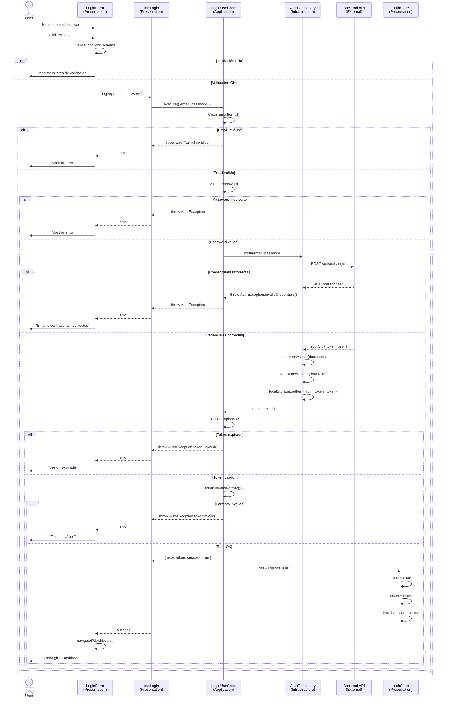

# Flujo de Login - Clean Architecture

## Diagrama de Flujo



## Capas Involucradas

### 1. **Presentation Layer** (UI)
- `LoginForm.tsx` - Captura input del usuario
- `useLogin.ts` - Adaptador entre React y Use Cases
- `authStore.ts` - Estado global de React

### 2. **Application Layer** (Casos de Uso)
- `LoginUseCase.ts` - Orquesta el flujo completo

### 3. **Domain Layer** (Entidades)
- `User.ts` - Entidad con lógica de negocio
- `Email.ts` - Value Object con validación
- `Token.ts` - Value Object con lógica de JWT
- `AuthException.ts` - Errores de negocio

### 4. **Infrastructure Layer** (Acceso Externo)
- `AuthRepository.ts` - Comunicación con la API

## Flujo Simplificado

```
User Input (email/password)
    ↓
LoginForm (validation)
    ↓
useLogin hook
    ↓
LoginUseCase.execute()
    ├─ Validate email (Domain)
    ├─ Validate password (Domain)
    └─ Call AuthRepository
        ↓
    AuthRepository.login()
        ├─ HTTP POST to API
        ├─ Parse JSON response
        ├─ Create User entity
        ├─ Create Token entity
        └─ Save to localStorage
        ↓
    LoginUseCase validates
        ├─ token.isExpired()
        └─ token.isValidFormat()
        ↓
    Return { user, token, success }
    ↓
useLogin hook
    └─ setAuth(user, token)
    ↓
authStore updated
    ↓
UI re-renders
    └─ Navigate to /dashboard
```

## Ventajas de este Flujo

1. **Separación de responsabilidades**
   - UI solo renderiza
   - Use Case tiene la lógica
   - Repository maneja HTTP

2. **Testeable en cada capa**
   - Domain: Sin dependencias
   - Application: Mock del Repository
   - Infrastructure: Mock de fetch
   - Presentation: Mock del Use Case

3. **Fácil de modificar**
   - Cambiar API → Solo AuthRepository
   - Cambiar validación → Solo Domain
   - Cambiar UI → Solo LoginForm
